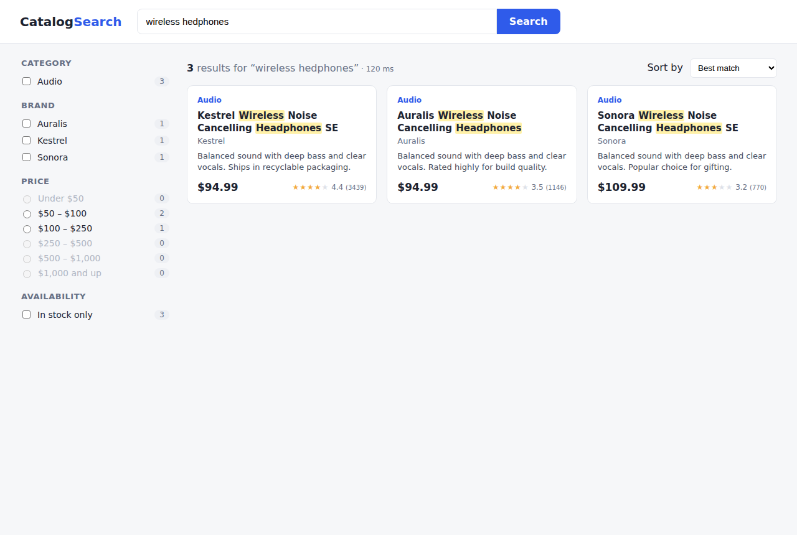
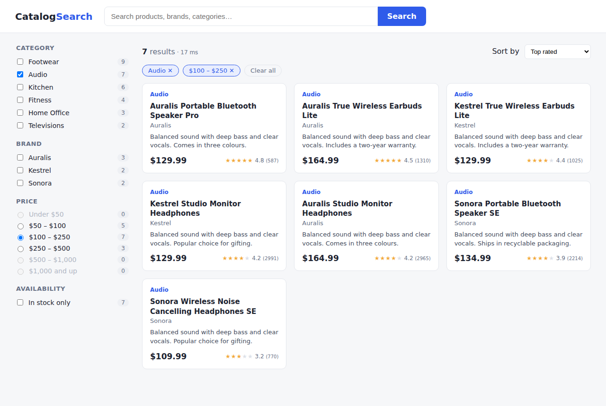
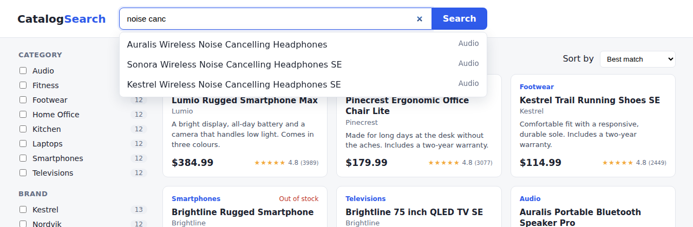

# product-search-service

Product search for an e-commerce catalogue, built on **Elasticsearch 8** with a **Java 21 / Spring Boot 3** API
and a **React + TypeScript** search page. It covers the parts of search that make a store usable:
relevance tuning, typo tolerance, synonyms, multi-select faceted navigation, autocomplete and highlighting.

[](https://github.com/eklavyachamp28/product-search-service/actions/workflows/ci.yml)

| Typo tolerance + highlighting | Multi-select facets |
|---|---|
|  |  |



## What the search does

- **Relevance** — `multi_match` (best_fields) over `name^3`, `brand^2`, `tags^1.5` and `description`, with all
  query words required (`operator: and`) and an extra boost when the words appear as a phrase in the name.
  The text score is then multiplied by `log1p(rating)` so well-reviewed products win close calls.
- **Typos** — `fuzziness: AUTO` with `prefix_length: 1`: *"wireless hedphones"* and *"gaming lapop"* find the
  right products, and the first letter has to be right, which keeps fuzzy matching fast.
- **Synonyms and stemming** — a `synonym_graph` filter applied at search time only (tv ↔ television,
  laptop ↔ notebook, headphones ↔ earphones…) plus light English stemming. Because synonyms are search-time
  only, the list can change without reindexing.
- **Faceted navigation** — category, brand, price band and availability with counts. Filters go in
  `post_filter` so they don't affect scoring, and **each facet's aggregation applies every filter except its
  own**. Ticking *Audio* still shows how many *Laptops* there are, which is how multi-select facets should behave.
- **Autocomplete** — `search_as_you_type` subfield on the product name queried with `bool_prefix`, so
  *"noise canc"* completes mid-word.
- **Highlighting** — matches are wrapped in `<mark>` with the `html` encoder, and the UI turns fragments into
  React nodes rather than using `innerHTML`, so product text can never inject markup.
- **Paging** — stable tie-break sort on `id`, and a hard cap on the result window (10k) with a clear 400 error.

The index mapping lives in [`products-index.json`](backend/src/main/resources/elasticsearch/products-index.json)
(`dynamic: strict`, `scaled_float` prices, keyword fields with a lowercase normalizer), so field types are
reviewed like code instead of being guessed by dynamic mapping.

## Stack

| Layer | Tech |
|---|---|
| Search | Elasticsearch 8.15, official `elasticsearch-java` client (typed query DSL) |
| API | Java 21, Spring Boot 3.3, Bean Validation, RFC 9457 problem details, springdoc-openapi |
| UI | React 18, TypeScript, Vite; state in a `useReducer` and mirrored to the URL (shareable searches, back button works) |
| Tests | JUnit 5 + AssertJ against a real Elasticsearch; Vitest + Testing Library |
| Ops | Docker Compose (Elasticsearch + API + nginx), GitHub Actions with an Elasticsearch service container |

## Run it

```bash
docker compose up --build
# UI:       http://localhost:8081
# API docs: http://localhost:8080/swagger-ui.html
```

On first start the API creates the index and loads a sample catalogue of 99 products (fictional brands).

### Local development

```bash
docker compose up elasticsearch          # or any ES 8 on localhost:9200
cd backend  && mvn spring-boot:run
cd frontend && npm ci && npm run dev      # http://localhost:5173, proxies /api to :8080
```

## Tests

```bash
cd backend  && mvn verify   # 26 tests: query DSL unit tests + integration tests on a real Elasticsearch
cd frontend && npm test     # 16 tests: state/URL logic, highlight safety, App behaviour with mocked API
```

The backend integration tests index the sample catalogue into a separate index and check behaviour, not just
status codes: typos and synonyms find the right products, facet counts are disjunctive, price bands filter
correctly, pages never overlap, autocomplete matches partial words.

## API

| Method | Path | Purpose |
|---|---|---|
| `GET` | `/api/products/search?q=&category=&brand=&minPrice=&maxPrice=&inStock=&sort=&page=&size=` | Search with facets. `category` and `brand` repeat for multi-select. `sort`: `relevance`, `price_asc`, `price_desc`, `rating`, `newest` |
| `GET` | `/api/products/suggest?prefix=` | Autocomplete |
| `GET` | `/api/products/{id}` | Fetch one product |
| `PUT` | `/api/products/{id}` | Create or replace (201 / 200) |
| `DELETE` | `/api/products/{id}` | Remove |

## Project layout

```
backend/src/main/java/com/aayusheklavya/search
├── search/   ProductQueryBuilder (pure DSL builder), ProductSearchService, SearchCriteria, results
├── catalog/  Product document, CatalogIndexer (index lifecycle, bulk load), seed runner
├── api/      REST controller, problem-detail error handling
└── config/   properties, JSON mapper for the ES client, CORS
backend/src/main/resources/elasticsearch   index mapping + sample catalogue
frontend/src
├── lib/         API client, search state reducer + URL sync, highlight renderer, hooks
└── components/  SearchBar (ARIA combobox), FacetPanel, ProductCard, Pagination
```

## Roadmap

- [ ] "Did you mean" using a phrase suggester when a query returns nothing
- [ ] Zero-downtime reindex through index aliases
- [ ] Search analytics (top queries, zero-result queries) to drive synonym tuning
- [ ] Learning-to-rank experiment using click data
